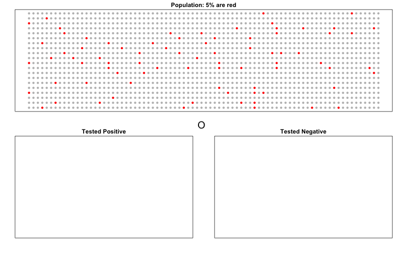
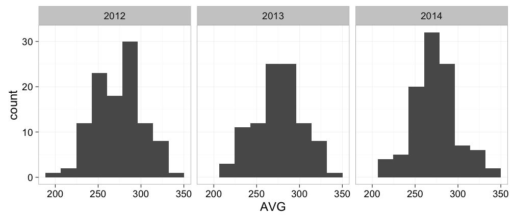
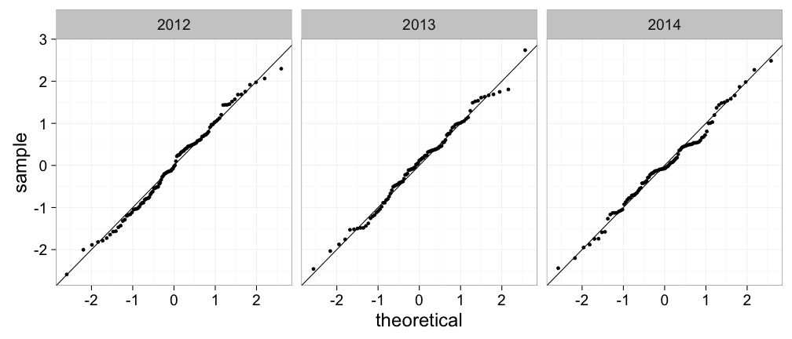

Bayes' Rule
====
author: Rafael A. Irizarry
transition: none


Cystic Fibrosis Test
====

* A test for cystic fibrosis has an accuracy of 99%: 

$$\mbox{Prob}(+\mid D)=0.99, \mbox{Prob}(-\mid \mbox{no } D)=0.99,$$


* If we select a random person and they test positive, what is the probability that they have disease? 

* We write this as $\mbox{Prob}(D\mid+)?$

* Cystic fibrosis rate is $\mbox{Prob}(D) \approx 0.00025$

Bayes Rule
====

<br>
<br>

$$
\mbox{Pr}(A|B)  =  \frac{\mbox{Pr}(B|A)\mbox{Pr}(A)}{\mbox{Pr}(B)} 
$$


Bayes Rule Applied to Cystic Fibrosis Test
====
<br>

$$
\begin{eqnarray*}
\mbox{Prob}(D|+) & = & \frac{ P(+|D) \cdot P(D)} {\mbox{Prob}(+)} \\
& = & \frac{\mbox{Prob}(+|D)\cdot P(D)} {\mbox{Prob}(+|D) \cdot P(D) + \mbox{Prob}(+|\mbox{no } D) \mbox{Prob}(\mbox{no } D)} \\
\end{eqnarray*}
$$


Bayes Rule
====

$$
\begin{eqnarray*}
\mbox{Prob}(D|+) & = & \frac{ P(+|D) \cdot P(D)} {\mbox{Prob}(+)} \\
& = & \frac{\mbox{Prob}(+|D)\cdot P(D)} {\mbox{Prob}(+|D) \cdot P(D) + \mbox{Prob}(+|\mbox{no } D) \mbox{Prob}(\mbox{no } D)} \\
& = & \frac{0.99 \cdot 0.00025}{0.99 \cdot 0.00025 + 0.01 \cdot (.99975)} \\
& = & 0.02 \;\;\; \mbox{not} \; \; \; 0.99
\end{eqnarray*}
$$


Monte Carlo Simulation
====

Assessment: Write a Monte Carlo simulation that shows this. Let's go step-by-step. http://goo.gl/forms/JPFdaptfkv  

* Define a population with 1 in 4000 people with CF.
* Take one at random
* Give them the test that is 99% accurate.
* Return one of four: TP, FP, TN, FN
* Repeat 10,000
* Compute TP / P = TP / (TP +FP)


```r
B = 1000000
res = replicate(B,{
x = sample(c(0,1),1, replace = T, prob = c(1-1/4000, 1/4000))
test = sample(c(1-x, x), 1, replace = TRUE, prob = c(0.01 , 0.99))
c(x,test)
} 
)
```

table(res[1,], res[2,])
sum(res[2,] == 1 & res[1,] == 1) / sum(res[2,] == 1)

c(x,test):
* 0,0: TN
* 1,1: TP
* 0,1: FP
* 1,0: FN


Simulation
===




Simulation
====

$\mbox{Prob}(D)$=% red on top, X means error, e.g. $+$ call when $\mbox{no } D$
$\mbox{Prob}(+ \mid D)$ = % red bottom left, $\mbox{Prob}(+)$=%bottom left. 


Application in Baseball
=====

José Iglesias 2013
===


***


| Month | At Bats | H | AVG |
|-------|---------|---|-----|
| April | 20      | 9 | .450   |

What is your prediction for his average in October?

Standard error is 
$$
\sqrt{\frac{.450 (1-.450)}{20}}=.111
$$

CI is $.450 \pm .222 =.228$ to $.672$.

No one has batted.400 since Ted Williams in
 1941!


Distribution of AVG 
===
This is for all players (>500 AB) 2010, 2011, 2012



Average is about 275 and SD is about 27
====

```r
options(digits = 3)
filter(Batting, yearID%in%2011:2014 & AB>500) %>%
  mutate(AVG=H/AB*1000) %>%
  group_by(yearID) %>% 
  summarize(mean(AVG), sd(AVG))
```

```
Source: local data frame [4 x 3]

  yearID mean(AVG) sd(AVG)
   (int)     (dbl)   (dbl)
1   2011       275    28.9
2   2012       274    28.0
3   2013       275    27.0
4   2014       273    26.0
```

And the distribution appears Normal
====




Hierarchical Model
===

Pick a random player, model their batting average after 20 AB?

$$\begin{eqnarray*}
\theta &\sim& N(\mu, \tau^2) \\
Y | \theta &\sim& N(\theta, \sigma^2) 
\end{eqnarray*}$$

Two levels of variability:

* Player to player variability
* Variability due to luck when batting

Hierarchical Model
===

$$\begin{eqnarray*}
\theta &\sim& N(\mu, \tau^2) \mbox{ is called a prior}\\
Y | \theta &\sim& N(\theta, \sigma^2) \mbox{ is called a sampling distribution}
\end{eqnarray*}$$

* $\theta$ is our players "intrinsic" average value
* $\mu$ is the average of all players
* $\tau$ is the SD of all players
* $Y$ is the observed average
* $\sigma$ is the variability due to luck at each AB 


Hierarchical Model
===

Here are the equations with our data

$$\begin{eqnarray*}
\theta &\sim& N(.275, .027^2) \\
Y | \theta &\sim& N(\theta, .110^2) 
\end{eqnarray*}$$


Posterior Distribution
====

The continuous version of Bayes rule can be used here

$$
\begin{eqnarray*}
f_{\theta|Y}(\theta|Y)&=&\frac{f_{Y|\theta}(Y|\theta) f_{\theta}(\theta)}{f_Y(Y)}\\
&=&\frac{f_{Y|\theta}(Y|\theta) f_{\theta}(\theta)}{\int_{\theta}f_{Y|\theta}(Y|\theta)f_{\theta}(\theta)}\\

\end{eqnarray*}
$$

We are particularly interested in the $\theta$ that maximizes $f_{\theta|Y}(\theta|Y)$.

We can show these are normal so all we need are: 

$$\mbox{E}(\theta|y) \mbox{ and } \mbox{var}(\theta|y)$$


Posterior Distribution
====

<br>

$$
\begin{eqnarray*}
\mbox{E}(\theta|y) &=& B \mu + (1-B) Y\\
&=& \mu + (1-B)(Y-\mu)\\
\mbox{with }B &=& \frac{\sigma^2}{\sigma^2+\tau^2}\\
\\
\mbox{var}(\theta\mid y) &=& \frac{1}{1/\sigma^2+1/\tau^2}
\end{eqnarray*}

$$


Posterior Distribution
====

In the case of José Iglesias, we have:

$$
\begin{eqnarray*}
E(\theta | Y=.450) &=& B \times .275 + (1 - B) \times .450 \\
&=& .275 + (1 - B)(.450 - .260) \\
B &=&\frac{.110^2}{.110^2 + .027^2} = 0.943\\
 &\approx& .285\\
\end{eqnarray*}
$$


$$
\begin{eqnarray*}
\mbox{var}(\theta\mid y) &=& \frac{1}{1/.110^2 + 1/.027^2}\\ &\approx&0.00069
\end{eqnarray*}
$$


SD is 0.026. The 95% _credible interval_ is (.233,.337)


Results
====

|Month|At Bat| Hits| AVG |
|-----|------|-----|-----|
|April|20|9|.450|
|May|26|11|.423|
|June|86|34|.395|
|July|83|17|.205|
|August|85|25|.294|
|September|50|10|.200|
|Total w/o April|330|97|.293|

Frequentist confidence interval = .450 $\pm$ 0.220

Empirical Bayes credible interval = .285 $\pm$ 0.052

Actual = .293


FiveThirtyEight
====


Primaries
====

[Florida predictions](http://projects.fivethirtyeight.com/election-2016/primary-forecast/florida-republican/)

Hierarchical Model to Predict Polls
===

You build a model (a prior) before seeing polls 
$$
\theta \sim N(\mu, \tau^2) 
$$

The you start seing poll data:

$$
Y | \theta \sim N(\theta, \sigma^2) 
$$

We update our prediction:

$$
\begin{eqnarray*}
\mbox{E}(\theta|y) &=&  \mu + (1-B)(Y-\mu)
\mbox{ with }B &=& \frac{\sigma^2}{\sigma^2+\tau^2}\\
\\
\mbox{var}(\theta\mid y) &=& \frac{1}{1/\sigma^2+1/\tau^2}
\end{eqnarray*}

$$


